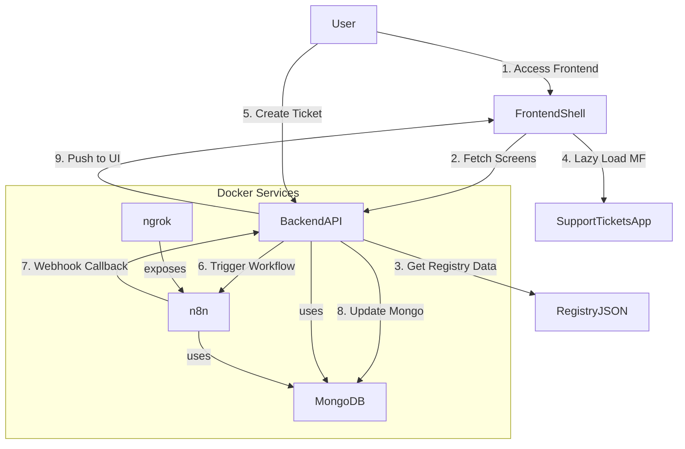

# FlowSync Technical Challenge

This repository contains the solution for the Flowbit technical challenge, demonstrating a multi-tenant slice with dynamic micro-frontend loading, secure API, and workflow integration.

## Project Structure

```
FlowSync/
├── .github/                  # GitHub Actions workflows
├── backend/                  # Node.js Express API
├── frontend-shell/           # React application (main shell)
├── support-tickets/          # React micro-frontend (Support Tickets App)
├── docker-compose.yml        # Docker Compose file for backend, n8n, MongoDB, ngrok
├── ngrok.yml                 # ngrok configuration for exposing n8n webhook
├── registry.json             # Hard-coded tenant and screen mapping
├── package.json              # Root package.json (for workspace setup if applicable)
└── README.md                 # This file
```

## Core Requirements Implemented

*  **R1: Auth & RBAC** – Email/password login with JWT (jsonwebtoken + bcrypt). JWT carries `customerId` and `role` (Admin/User). Middleware restricts `/admin/*` routes to Admins only.
*  **R2: Tenant Data Isolation** – All Mongo collections include `customerId`. Includes Jest test to ensure isolation across tenants.
*  **R3: Use-Case Registry (MVP)** – Hardcoded `registry.json` maps tenants to screen URLs. Implemented `/me/screens` endpoint.
*  **R4: Dynamic Navigation** – React shell fetches `/me/screens`, renders sidebar, and lazy-loads remote `SupportTicketsApp` via Webpack Module Federation.
*  **R5: Workflow Ping** – `POST /api/tickets` triggers n8n workflow. Workflow calls back to `/webhook/ticket-done` with secret header. Flowbit backend validates it, updates ticket status, and UI polls for updates.
*  **R6: Containerised Dev** – `docker-compose up` starts MongoDB, backend, n8n, and ngrok. Frontends (`frontend-shell`, `support-tickets`) are run locally for flexibility.

##  Bonus Features Implemented

*  **Audit Log** – Basic logging of ticket events: `{action, userId, tenant, timestamp}`
*  **Cypress Smoke Test** – End-to-end test: login → create ticket → verify status update.
*  **GitHub Actions CI** – Workflow lints and runs Jest unit tests on push.

##  Quick Start

1. **Prerequisites**:

   * Docker & Docker Compose
   * Node.js (for local development)
   * npm or yarn

2. **Clone the repository**:

   ```bash
   git clone https://github.com/mdsadiqueshakeel/FlowSync
   cd FlowSync
   ```

3. **Configure ngrok (for webhook testing)**:

   * Get authtoken from [ngrok.com](https://ngrok.com/)
   * Paste it in `ngrok.yml`
   * Update `WEBHOOK_URL` in `docker-compose.yml` under the `n8n` service

4. **Start backend services**:

   ```bash
   docker-compose up --build
   ```

5. **Run frontends locally**:

   * In `frontend-shell`, run:

     ```bash
     npm install && npm run dev
     ```
   * In `support-tickets`, run:

     ```bash
     npm install && npm run dev -- --port 5001
     ```

6. **Access the apps**:

   * Frontend: `http://localhost:5173`
   * n8n UI: `http://localhost:5678`
   * Backend: `http://localhost:4000`

##  Architecture Diagram

> ⚠️ This Mermaid diagram is best viewed in VS Code or supported Markdown renderers. GitHub doesn't render it.



##  Known Limitations

* `WEBHOOK_URL` must be manually updated with ngrok URL after it starts.
* Frontends are not containerized due to local dev constraints.

> Apologies: Due to local limitations, frontend apps were not dockerized. However, all backend services including MongoDB, n8n, and ngrok are fully containerized and integrated. The project demonstrates full end-to-end functionality.

##  Verification Checklist

* [x] Login as LogisticsCo & RetailGmbH
* [x] Create tickets
* [x] See live status updates
* [x] Confirm tenant isolation in UI and DB
* [x] Confirm webhook round-trip from n8n → FlowSync

---

**For full demonstration, refer to the attached demo video showing the entire flow.**
